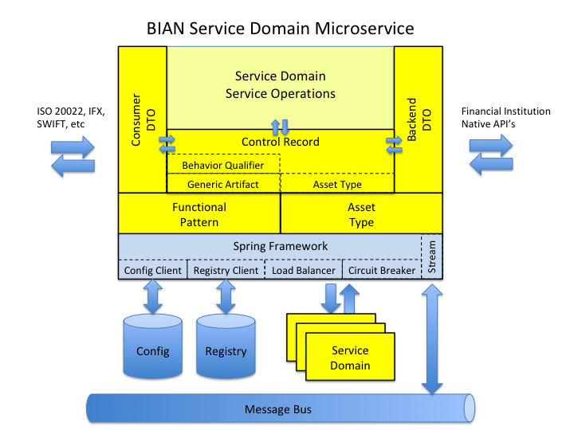

# Spring BIAN Java Reference Architecture Library

BIAN (Banking Industry Architecture Network) is a membership group committed to developing open standards around banking and financial services.  A key deliverable of this group is the BIAN Service Landscape model which defines a comprehensive services architecture for financial transactions and facilities.  This library is an implementation of the BIAN model leveraging the Spring framework and allows a developer to rapidly create BIAN-compliant services while hiding much of the underlying BIAN model details.  See www.bian.org for more information on BIAN.

This library leverages not only the Spring framework, but a number of the Spring Cloud Services components as well to facilitate building robust and resilient cloud-native BIAN microservices, and is aligned with the Wave 3 approach of the BIAN implementation model.  Spring components that are used:

- [Spring Boot](http://projects.spring.io/spring-boot/)
- [Spring Cloud Netflix](https://cloud.spring.io/spring-cloud-netflix/)
- [Spring Cloud Stream](https://cloud.spring.io/spring-cloud-stream/)

## BIAN Basics

Before diving into the library architecture, it helps to understand two key concepts within BIAN, service domains and control records.

### Service Domain

The BIAN Service Landscape defines discrete areas of responsibility known as service domains.  A **Service Domain** is a combination of a **Functional Pattern** and an **Asset Type**.  For instance, using the functional pattern 'Registry' with the asset type 'Product' would yield a 'Product Registry' service domain, which could be used to manage a product catalog.  If we instead changed the asset type to 'Device', we would have a 'Device Registry' service domain that could be used to authorize services on a mobile device.  

### Control Record

The **Control Record** is used to track the state of a service domain, and like the service domain is derived from the functional pattern and asset type.  However, in a control record, the functional pattern is represented by the **Generic Artifact Type**.  There is a one-to-one correlation between functional patterns and generic artifact types.  The control record goes one step further in delineating between specific service domain operations by introducing an additional parameter called the **Behavior Qualifier**, which, like generic artifact types, have a one-to-one correlation with functional patterns.

### BIAN Summary

So to summarize the above:

**Functional Pattern** ==> **Generic Artifact Type** ==> **Behavior Qualifier**

**Functional Pattern** + **Asset Type** = **Service Domain**

**Generic Artifact Type** + **Asset Type** + (optional)**Behavior Qualifier** = **Control Record**

## Architecture

The Spring BIAN library implements a BIAN service domain wrapper that acts as an API and data translator while hiding much of the BIAN model complexity from the developer:



Components in blue are provided by the Spring framework, dark yellow are provided by this library, and light yellow are provided by the developer.

### Spring components (blue)

- RESTful microservice (via Spring Boot)
- Distributed central service configuration (via Spring Config Server)
- Dynamic service registration and resolution (via Eureka Registry Server)
- Service-to-service load balancing (via Ribbon)
- Service outage quick failover, state tracking and reporting (via Circuit Breaker)

### Spring BIAN library components (dark yellow)

- BIAN functional pattern specific service classes (Functional Pattern)
- BIAN asset type base classes (Asset Type)
- BIAN generic artifact classes (Generic Artifact)
- BIAN behavior qualifier classes (Behavior Qualifier)
- BIAN control record classes (Control Record)
- BIAN service domain specific control record classes
- Common DTO (Data Transfer Object) methodology classes for data mapping between front facing API and internal control record
- Common DTO (Data Transfer Object) methodology classes for data mapping between internal control record and native backend payloads
- Service Operation handling with default handlers for functional pattern services per BIAN specification.
- RESTful method to BIAN service operation mapper and handling
- Service exception handling
- Service status and BIAN information endpoints

### Developer provided components (light yellow)

- Service domain service operation handlers
- DTO mapping rules for front facing consumer API
- DTO mapping rules for backend native API's


## Usage

The repository contains the following modules:

- spring-bian-core - the core Spring BIAN library
- spring-bian-samples - example Spring BIAN library clients

### Installing the library

After cloning the repository to a local directory, install the library by executing the following from within the BIAN library folder

```
mvn clean install -DskipITs
```

This will compile, test and copy the Spring BIAN library to your local maven repository.

### Using the library

1. Create a basic Spring Boot RESTful application.  [Spring Initializr](http://start.spring.io/) is a helpful tool for this.  Here are some common modules to add to your project:
  * Web - web application framework
  * Config Client - spring config server client
  * Eureka Discovery - service registration and discovery
  * Hystrix - circuit breaker
  * Sleuth - distributed tracing
  * Actuator - application monitoring and management

   Optional modules:

  * JPA - persistence API
  * Persistence engine (MySQL, JDBC, etc)

   External dependencies:

  * Swagger2 - API documentation
  * Jackson - data mapping
  * ModelMapper - DTO data mapping
2. Add the bian-core library to your dependencies (io.pivotal.spring.bian-core)

   **pom.xml**
```
<dependency>
        <groupId>io.pivotal.spring</groupId>
        <artifactId>bian-core</artifactId>
        <version>${revision}</version>
</dependency>
```  
3. Identify the BIAN functional pattern of the service domain, and create a RESTful service that subclasses the appropriate BIAN functional service (io.pivotal.spring.bian.service.\*).  By subclassing the functional service, your service automatically inherits a host of common functionality like RESTful endpoints, messaging, error handling, in addition to BIAN functional pattern specific service operation handling.
1. Identify the payload structure of the service domain, both for internal field usage and external data standard mappings
1. Create data mappings for API input to control record, control record to API output, and control record to service back-end.
1. Implement the stubbed-out service operation calls by making any necessary back-end native calls.
